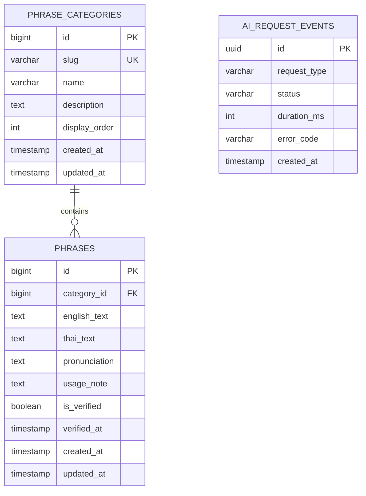

# Database Design

## 1. Design Goals

The MVP database supports the Thai Phrase Helper and, optionally, non-sensitive operational metadata for AI requests. The design follows these principles:

- Keep the schema small enough for an MVP.
- Store Thai and English text using UTF-8.
- Do not persist raw student questions or university notices by default.
- Allow phrase categories and content to be maintained independently.
- Record verification information for phrase quality.

## 2. Data Scope

### Persisted in the MVP

- Phrase categories.
- Thai phrases, English meanings, and pronunciations.
- Phrase verification state and timestamps.
- Optional request status metadata for monitoring reliability.

### Not persisted by default

- Raw AI Student Assistant questions.
- Raw university-notice text.
- Generated answers or summaries.
- Names, student IDs, contact details, or authentication data.

Anonymous AI interactions do not require a user table. Accounts, saved history, feedback, and content administration can be designed in a later release if they become prioritized backlog items.

## 3. Entity Relationship Diagram



`AI_REQUEST_EVENTS` is independent because it contains operational metadata only and does not identify a user or store submitted content.

## 4. Data Dictionary

### 4.1 `phrase_categories`

| Column | Type | Rules | Description |
|---|---|---|---|
| `id` | BIGINT | Primary key, generated | Internal category identifier |
| `slug` | VARCHAR(50) | Required, unique | Stable URL/code value, such as `transportation` |
| `name` | VARCHAR(100) | Required | English display name |
| `description` | TEXT | Optional | Explanation of the situation covered |
| `display_order` | INTEGER | Required, default 0 | Order in the interface |
| `created_at` | TIMESTAMP | Required | Creation time |
| `updated_at` | TIMESTAMP | Required | Last update time |

Initial category slugs are `university`, `transportation`, `restaurants`, `shopping`, and `emergencies`.

### 4.2 `phrases`

| Column | Type | Rules | Description |
|---|---|---|---|
| `id` | BIGINT | Primary key, generated | Internal phrase identifier |
| `category_id` | BIGINT | Required, foreign key | Parent phrase category |
| `english_text` | TEXT | Required | English meaning |
| `thai_text` | TEXT | Required | Phrase in Thai script |
| `pronunciation` | TEXT | Required | Latin-script pronunciation aid |
| `usage_note` | TEXT | Optional | Context, politeness, or usage warning |
| `is_verified` | BOOLEAN | Required, default false | Whether the content has been reviewed |
| `verified_at` | TIMESTAMP | Optional | Time of verification |
| `created_at` | TIMESTAMP | Required | Creation time |
| `updated_at` | TIMESTAMP | Required | Last update time |

### 4.3 `ai_request_events` (optional)

| Column | Type | Rules | Description |
|---|---|---|---|
| `id` | UUID | Primary key, generated | Random event identifier |
| `request_type` | VARCHAR(30) | Required, constrained | `assistant` or `notice_simplifier` |
| `status` | VARCHAR(20) | Required, constrained | `started`, `succeeded`, `failed`, or `blocked` |
| `duration_ms` | INTEGER | Optional, non-negative | Request duration after completion |
| `error_code` | VARCHAR(50) | Optional | Non-sensitive error category |
| `created_at` | TIMESTAMP | Required | Event creation time |

This table must not contain prompts, notices, AI output, IP addresses, or other identifiers in the MVP.

## 5. Relationships and Integrity Rules

- One phrase category can contain zero or many phrases.
- Every phrase belongs to exactly one category.
- Deleting a category that still has phrases should be restricted.
- `slug` must be unique so routes and filters remain stable.
- `verified_at` must be present when `is_verified` is true and absent when it is false.
- AI event types and statuses must be restricted to their documented values.
- `duration_ms` cannot be negative.

## 6. Suggested SQL Schema

The following PostgreSQL-compatible definition expresses the logical design. Equivalent types may be used with another relational database.

```sql
CREATE TABLE phrase_categories (
    id BIGINT GENERATED ALWAYS AS IDENTITY PRIMARY KEY,
    slug VARCHAR(50) NOT NULL UNIQUE,
    name VARCHAR(100) NOT NULL,
    description TEXT,
    display_order INTEGER NOT NULL DEFAULT 0,
    created_at TIMESTAMPTZ NOT NULL DEFAULT CURRENT_TIMESTAMP,
    updated_at TIMESTAMPTZ NOT NULL DEFAULT CURRENT_TIMESTAMP
);

CREATE TABLE phrases (
    id BIGINT GENERATED ALWAYS AS IDENTITY PRIMARY KEY,
    category_id BIGINT NOT NULL
        REFERENCES phrase_categories(id) ON DELETE RESTRICT,
    english_text TEXT NOT NULL,
    thai_text TEXT NOT NULL,
    pronunciation TEXT NOT NULL,
    usage_note TEXT,
    is_verified BOOLEAN NOT NULL DEFAULT FALSE,
    verified_at TIMESTAMPTZ,
    created_at TIMESTAMPTZ NOT NULL DEFAULT CURRENT_TIMESTAMP,
    updated_at TIMESTAMPTZ NOT NULL DEFAULT CURRENT_TIMESTAMP,
    CONSTRAINT phrases_verification_check CHECK (
        (is_verified = TRUE AND verified_at IS NOT NULL)
        OR (is_verified = FALSE AND verified_at IS NULL)
    )
);

CREATE TABLE ai_request_events (
    id UUID PRIMARY KEY,
    request_type VARCHAR(30) NOT NULL
        CHECK (request_type IN ('assistant', 'notice_simplifier')),
    status VARCHAR(20) NOT NULL
        CHECK (status IN ('started', 'succeeded', 'failed', 'blocked')),
    duration_ms INTEGER CHECK (duration_ms >= 0),
    error_code VARCHAR(50),
    created_at TIMESTAMPTZ NOT NULL DEFAULT CURRENT_TIMESTAMP
);

CREATE INDEX idx_phrases_category_id ON phrases(category_id);
CREATE INDEX idx_phrase_categories_display_order
    ON phrase_categories(display_order);
CREATE INDEX idx_ai_request_events_created_at
    ON ai_request_events(created_at);
```

For a small dataset, application-level case-insensitive search is acceptable. If phrase volume grows, the team can add database-specific full-text or trigram indexes after measuring performance.

## 7. Example Phrase Record

```json
{
  "category": "university",
  "english_text": "Where is the registrar's office?",
  "thai_text": "ห้องทะเบียนอยู่ที่ไหนครับ/คะ",
  "pronunciation": "Hong tha-bian yu thi nai khrap/kha?",
  "usage_note": "Use khrap for a typically masculine polite ending and kha for a typically feminine polite ending.",
  "is_verified": false
}
```

The example remains unverified until reviewed by a competent Thai-language reviewer.

## 8. Privacy, Security, and Retention

- Database credentials must be provided through environment configuration and excluded from version control.
- The application must use parameterized queries or a trusted ORM to reduce SQL-injection risk.
- Database access should use the least privilege required by the application.
- Backups and logs must not introduce storage of raw questions or notice text.
- Optional AI event metadata should have a short, documented retention period; 30 days is a reasonable MVP starting point.
- If saved history or accounts are proposed later, the team must perform a new privacy and security review before adding related tables.

## 9. Future Extensions

Possible later entities include users, saved conversations, notice history, feedback, sources, universities, and multilingual translations. They are intentionally excluded from the MVP schema to avoid premature complexity and unnecessary collection of personal data.
